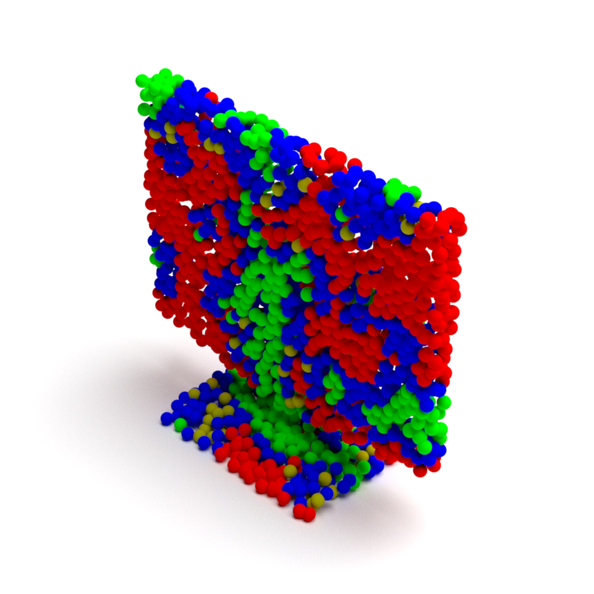

# Mitsuba4PCD

**Mitsuba4PCD** 是一个基于 Python 和 Mitsuba 的点云渲染工具，利用 Mitsuba 丰富的功能来渲染虚拟点云场景。注意：Mitsuba 0.6 适用于 CPU 渲染，而 Mitsuba 3.0 适用于 GPU 渲染。

[](doc/test.mp4)

## 功能特性

- **高质量渲染**：利用 Mitsuba 3.0 的强大功能，渲染物理精确且逼真的点云场景。
- **Python 集成**：提供简单易用的 Python API，用于加载和处理点云数据。
- **灵活的渲染设置**：支持自定义光照、材质和相机参数，以满足不同的渲染需求。
- **可扩展性**：轻松与其他数据处理和机器学习库集成。

## 安装

请确保已安装 [Mitsuba 3.0](https://www.mitsuba-renderer.org/)。

或者按照以下步骤设置环境：

```bash
conda create --name m4pcd python=3.10 -y
conda activate m4pcd
pip install -r requirements.txt
```

## 快速开始

以下是一个简单的示例，展示如何使用此库渲染点云：

```python
# 加载数据
pcl, colors = process_data(in_path)

for i in range(len(args.axis)):
    pcl = rotate(pcl, args.axis[i], args.yum[i])

# 标准化处理
mins = np.amin(pcl, axis=0)
maxs = np.amax(pcl, axis=0)
pcl = standardize_point(pcl, mins, maxs)
pcl = pcl[:, [2, 0, 1]]
pcl[:, 0] *= -1
pcl[:, 2] += 0.0125

# 将信息保存为 XML 文件
xml_path = os.path.join(args.workdir, out_path + ".xml") 
xml_head = init_head(args)
xml_tail = init_tail(args.radius, np.min(pcl[:, 2]))
xml = xml_head
xml = add_point_cloud(pcl, colors, args.radius, xml)
xml.append(xml_tail)
xml_content = str.join("", xml)
with open(xml_path, "w") as f:
    f.write(xml_content)

# 渲染图片
render(xml_path)
```

## 许可证

本项目使用 [MIT 许可证](LICENSE)。

## 联系方式

如有任何问题或建议，请通过 [wcx0602@mail.ustc.edu.cn](mailto:wcx0602@mail.ustc.edu.cn) 联系我们。
